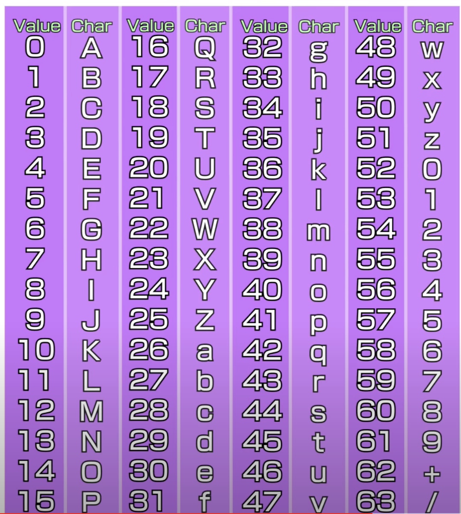

# Bases
* **Points:** 100
* **Category:** Generald Skills

## Description
> What does this `bDNhcm5fdGgzX3IwcDM1` mean? 
>
> I think it has something to do with bases.

## Solution
You can run `bDNhcm5fdGgzX3IwcDM1` through an online Base64 decoder <a href="https://www.base64decode.org/">like this one</a> to get the flag easily. 

But that leaves us with a lot of questions. What *is* Base 64? How is Base 64 encoded / encoded? What is Base 64 used for? 

These questions took me down a little rabbit hole of internet history that I'll *attempt* to summarize here.  

Email was first developed in the early days of the internet and only 7bit characters (0-128) could be sent over it. 128 characters isn't a lot. A-Z,a-z,0-9 uses 62 characters alone, and when you consider languages that aren't english you start to run out of 7bit characters really fast. A bigger problem was that if I wanted to send an 8-bit file over email (which only takes 7 bits) there wasn't a way to do that. This is where base 64 comes in. You get an extra character with base64, but it's 7 bit compatable. 

Base64 takes 8bits of data and encodes it into a 7bit compatible format with the following process. 
1. Takes the Ascii values of three characters and converts them into 8 bit bytes
2. Concatenates those bits into a 24 bit string. 
3. Takes that 24 bit string and breaks it into four 6 bit "bytes" (6^2 = 64)
4. Takes the decimal values of those 6 bit bytes returns a character based on the Base64 index table. 

 

Using the Base 64 index table let's manually decode the first four characters into the first three ascii characters of the flag (`bDNh`). 

### **1. Find the index value of each character and then convert that into the 6 bit value.**

|base64 char|index value|6 bit value| 
|------|-----|-----|
|b|27|011011|
D|3|000011
N|13|001101
h|33|100001

### **2. Concatenate into those four 6 bit strings a 24 bit string:**
 011011000011001101100001

### **3. Convert back into 8 bit bytes:**
01101100 
00110011 
01100001

### **4. Convert those bytes into their decimal values and then user our <a href="https://www.asciitable.com/">handy ascii table</a> to find the letter:**

|Byte|Decimal Value|Decoded ASCII|
|----|----|----|
|01101100|108|l|
|00110011|51|3|
|01100001|97|a|

So we've successfully converted the base64 string `bDHn` into the ASCII string `l3a`, which is the first part of the flag.

Knowing that I *could* continue this process, I'm more comfortable with using an existing decoder to finish the rest of the process. 

Sources: 
<ul>
<li>https://www.base64decode.org/</li>
<li>https://www.youtube.com/watch?v=8qkxeZmKmOY</li>
<li>https://allthewebtools.com/base64-encode#base64_index_table</li>
</ul>

- **flag:**
`picoCTF{l3arn_th3_r0p35}`
